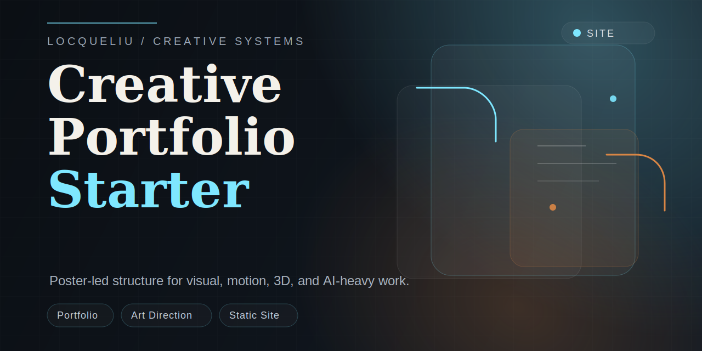

# creative-portfolio-starter

[Chinese Version](./README_zh.md)

This is the portfolio structure I reach for when I want a site to feel closer to a poster or campaign page than a dashboard full of cards.

I built it around the kind of work I care about most: visual direction, motion, AI-assisted production, 3D, and projects that benefit from a strong first screen.

## What is inside

- a full-bleed landing section with a clear visual hierarchy
- a case-study layout built for a small number of stronger projects
- grouped capability rows for design, motion, 3D, and AI systems
- lightweight reveal behavior with no framework dependency
- a static structure that is easy to host anywhere

## Files

- `index.html` page structure
- `styles.css` layout, art direction, motion, and responsive rules
- `data.js` project data and grouped capability content
- `main.js` lightweight rendering and reveal behavior

## Why I keep this starter around

Many portfolio templates are optimized for quantity. I usually want the opposite:

- one strong opening image or statement
- fewer projects, but each one feels intentional
- enough technical depth to show how the work was made
- a contact path that is visible without feeling like a sales page

## How to use

1. Replace the sample content in `data.js`
2. Rewrite the hero around your own direction and niche
3. Swap the CTA link for your own contact or domain
4. Host it with GitHub Pages, Netlify, or any static platform

## Good customizations

- replace the placeholder case studies with real work
- keep one result, one process note, and one strong visual for each project
- group tools by outcome instead of listing software names without context
- keep the first screen clean and intentional

## License

MIT
