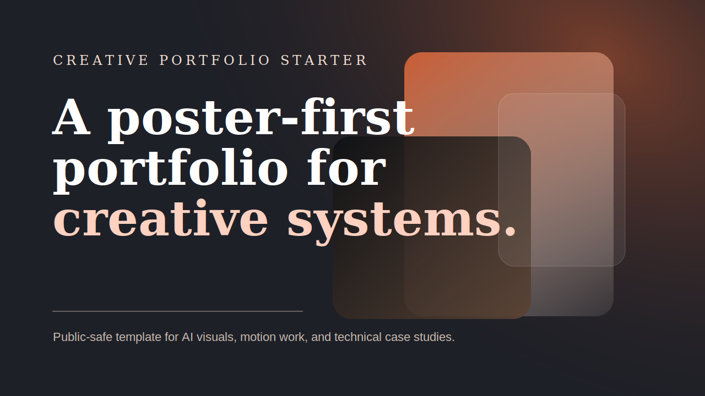

# creative-portfolio-starter

[English Version](./README.md)

这个仓库是我自己做作品集页面时会优先拿来改的一套底子。

我一直不太吃那种“默认模板味”很重的作品集。打开就是一排卡片、一堆图标、再来几条技能进度条，看完很容易谁都像谁。所以这个版本我故意往另一个方向做：首屏先把气质立住，项目不用很多，但每个都得有点分量。

## 里面现在有什么

- 一个铺满首屏的开场结构，先把氛围拉起来
- 一个更适合放强项目的案例区，不走普通卡片墙路线
- 按设计、动效、3D、AI 系统分组的能力区
- 不靠框架、比较轻的入场动画
- 静态部署很方便的页面结构

## 文件说明

- `index.html` 页面结构
- `styles.css` 版式、视觉和响应式规则
- `data.js` 项目数据和能力分组
- `main.js` 渲染逻辑和一些轻量交互

## 我为什么一直留着这个版本

因为很多作品集模板都太平均了，安全是安全，但没记忆点。

我更想要的是这种感觉：

- 第一屏就先让人记住你
- 项目不用铺太满，但每个都要站得住
- 不只是展示结果，也能让人隐约看出你怎么做事
- 联系方式清楚，但页面本身别搞得像在硬卖

## 怎么用

1. 先把 `data.js` 里的示例内容换掉
2. 按你自己的方向重写首屏文案
3. 把 CTA 链接换成你的联系方式或域名
4. 部署到 GitHub Pages、Netlify 或任意静态平台

## 我觉得比较值得改的地方

- 用你自己最能打的项目换掉占位案例
- 每个项目尽量留一个结果、一个过程点、一个强视觉
- 工具别只堆名字，最好按产出方式分组
- 第一屏尽量克制，别一股脑全塞进去

## License

MIT
